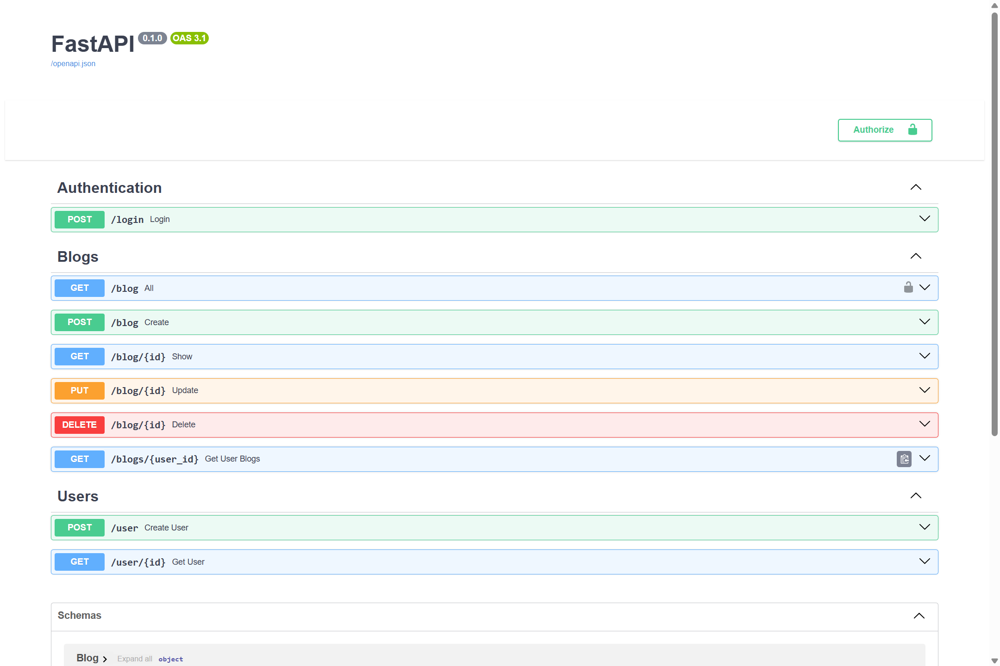

# FastAPI Blog Application

This is a FastAPI application designed for blog management. It includes features for user authentication, blog post creation, and data validation.

## Features and Functionalities

- **User Authentication**: The application uses JWT tokens and OAuth2 authentication to ensure secure access. Users can register, log in, and manage their accounts with peace of mind, knowing their data is protected.

- **Blog Management**: Users can create, update, and delete blog posts. The application supports rich text formatting, allowing users to create engaging and visually appealing content.

- **Data Validation**: The application uses Pydantic schemas to validate request and response payloads. This ensures data consistency and integrity, preventing errors and inconsistencies.

- **User Management**: Administrators can manage user accounts, including creating, updating, and deleting users. This feature is crucial for maintaining a healthy and active user base.

- **Secure Password Storage**: Passwords are securely hashed before being stored in the database. This prevents anyone, including database administrators, from viewing user passwords.

- **Database Interactions**: The application uses SQLAlchemy to interact with the database. This provides a high level of abstraction, making it easier to perform complex database operations.

## Usage

To run the FastAPI application:

1. Install the required dependencies listed in `requirements.txt`.
2. Configure your database connection in `database.py`.
3. Execute `uvicorn main:app --reload` from the project directory to start the FastAPI server with automatic reloading on code changes.

#

#

Please note that this application is under development and may undergo significant changes.

